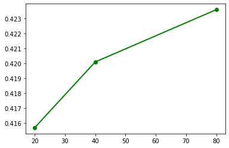

# Optimal cost profit exercise
Given a list of stocks with price and cost (see format of the file in data folder), look for the optimal subset for a given max cost.<br>
Only one of each stock can be bought.<br>

Project made while studying python, with 2 algorithms, bruteforce and 0/1 knapsack.

## Bruteforce
```python
INPUT_FILE = 'data/actions.csv'
```

## Load csv


```python
import pandas as pd

df = pd.read_csv(INPUT_FILE)

# Transform percent to float
df['profit'] = df['profit'].apply(lambda x: x / 100)
df['gain'] = df['price'] * df['profit']

df.index +=1

df
```


<div>
<style scoped>
    .dataframe tbody tr th:only-of-type {
        vertical-align: middle;
    }

    .dataframe tbody tr th {
        vertical-align: top;
    }

    .dataframe thead th {
        text-align: right;
    }
</style>
<table border="1" class="dataframe">
  <thead>
    <tr style="text-align: right;">
      <th></th>
      <th>name</th>
      <th>price</th>
      <th>profit</th>
      <th>gain</th>
    </tr>
  </thead>
  <tbody>
    <tr>
      <th>1</th>
      <td>A-1</td>
      <td>20</td>
      <td>0.05</td>
      <td>1.00</td>
    </tr>
    <tr>
      <th>2</th>
      <td>A-2</td>
      <td>30</td>
      <td>0.10</td>
      <td>3.00</td>
    </tr>
    <tr>
      <th>3</th>
      <td>A-3</td>
      <td>50</td>
      <td>0.15</td>
      <td>7.50</td>
    </tr>
    <tr>
      <th>4</th>
      <td>A-4</td>
      <td>70</td>
      <td>0.20</td>
      <td>14.00</td>
    </tr>
    <tr>
      <th>5</th>
      <td>A-5</td>
      <td>60</td>
      <td>0.17</td>
      <td>10.20</td>
    </tr>
    <tr>
      <th>6</th>
      <td>A-6</td>
      <td>80</td>
      <td>0.25</td>
      <td>20.00</td>
    </tr>
    <tr>
      <th>7</th>
      <td>A-7</td>
      <td>22</td>
      <td>0.07</td>
      <td>1.54</td>
    </tr>
    <tr>
      <th>8</th>
      <td>A-8</td>
      <td>26</td>
      <td>0.11</td>
      <td>2.86</td>
    </tr>
    <tr>
      <th>9</th>
      <td>A-9</td>
      <td>48</td>
      <td>0.13</td>
      <td>6.24</td>
    </tr>
    <tr>
      <th>10</th>
      <td>A-10</td>
      <td>34</td>
      <td>0.27</td>
      <td>9.18</td>
    </tr>
    <tr>
      <th>11</th>
      <td>A-11</td>
      <td>42</td>
      <td>0.17</td>
      <td>7.14</td>
    </tr>
    <tr>
      <th>12</th>
      <td>A-12</td>
      <td>110</td>
      <td>0.09</td>
      <td>9.90</td>
    </tr>
    <tr>
      <th>13</th>
      <td>A-13</td>
      <td>38</td>
      <td>0.23</td>
      <td>8.74</td>
    </tr>
    <tr>
      <th>14</th>
      <td>A-14</td>
      <td>14</td>
      <td>0.01</td>
      <td>0.14</td>
    </tr>
    <tr>
      <th>15</th>
      <td>A-15</td>
      <td>18</td>
      <td>0.03</td>
      <td>0.54</td>
    </tr>
    <tr>
      <th>16</th>
      <td>A-16</td>
      <td>8</td>
      <td>0.08</td>
      <td>0.64</td>
    </tr>
    <tr>
      <th>17</th>
      <td>A-17</td>
      <td>4</td>
      <td>0.12</td>
      <td>0.48</td>
    </tr>
    <tr>
      <th>18</th>
      <td>A-18</td>
      <td>10</td>
      <td>0.14</td>
      <td>1.40</td>
    </tr>
    <tr>
      <th>19</th>
      <td>A-19</td>
      <td>24</td>
      <td>0.21</td>
      <td>5.04</td>
    </tr>
    <tr>
      <th>20</th>
      <td>A-20</td>
      <td>114</td>
      <td>0.18</td>
      <td>20.52</td>
    </tr>
  </tbody>
</table>
</div>


Make a list of 20 tuples (action, cout action, gain action)


```python
# Make a list of 20 tuples (action, cout action, gain action) prior to compute all combinations
actions_cost_profit = []

# Iterate over each row
for index, rows in df.iterrows():  # n steps -> O(n)
    actions_cost_profit.append((rows.name, rows.price, rows.gain))  # method append: O(1)
```

**Time complexity to get the list of actions : O(n)**

## Get all possible combinations


```python
def get_combos(actions):
    """
    Recursive function to get all actions combinations
    :param actions: list of actions (tuples: 'action_name', cost, profit)
    :return: all actions combination
    """

    if not actions:
        # BASE CASE
        return [[]]

    # RECURSIVE CASE
    combos = []
    head = [actions[0]]
    tail = actions[1:]

    tail_combos = get_combos(tail)
    for t in tail_combos:
        combos.append(head + t)

    combos = combos + tail_combos
    return combos
```

### Time complexity of get_combos

3 tests :
* dataset actions1.csv (20 actions) : time 0.4157
* dataset actions2.csv (40 actions) : time 0.4201
* dataset actions3.csv (80 actions) : time 0.4236


```python
import matplotlib.pyplot as plt
plt.plot([20, 40, 80], [0.4157, 0.4201, 0.4236], color='green', marker='o', linewidth=2)
```


    [<matplotlib.lines.Line2D at 0x2002f55cdc0>]


    

    


The get_combos function has a complexity of **O(log n)**.<br>

## Get ROI


```python
def roi(combos):
    """
    Function that computes cost and profit for each combination and append it to combination
    :param combos: list of all combinations (each combination is a list of tuples: action_name, cost, profit)
    :return: generator
    """

    for combo in combos:  # steps = c = nb combos
        cost = 0
        profit = 0

        for action in combo:  # steps = n = nb actions
            cost += action[1]
            profit += action[2]

        combo.append(cost)  # method append() : O(1)
        combo.append(profit)

        yield combo
```

### Time complexity of roi
The roi function has a time complexity of O(nc)<br>
As c = 2<sup>n</sup>, the roi function has a time complexity of O(n2<sup>n</sup>), or **O(2<sup>n</sup>)**

## Get max profit for cost <= 500


```python
def best_combo(max_cost):
    all_combos = []
    for comb in roi(get_combos(actions_cost_profit)):  # steps = nomb combos
        *actions, cost, profit = comb
        if cost > max_cost:
            continue
        all_combos.append([[*actions], cost, profit])  # method append(): O(1)
    best = max(all_combos, key=lambda sublist: sublist[2])  # max: O(n)

    best_comb_ = [i[0] for i in best[0]]
    min_cost_ = best[1]
    max_profit_ = best[2]

    return best_comb_, min_cost_, max_profit_


best_comb, min_cost, max_profit = best_combo(500)

print(f"Meilleure combinaison : {best_comb} \n"
      f"Cout: {min_cost} \n"
      f"Gain: {max_profit}")
```

    Meilleure combinaison : [4, 5, 6, 8, 10, 11, 13, 18, 19, 20] 
    Cout: 498 
    Gain: 99.08000000000001
    

### Time complexity of best_combo
The best_combo function has a time complexity of **O(n)**

### Total complexity : O(2<sup>n</sup>)
Time will increase exponentially as data grows

